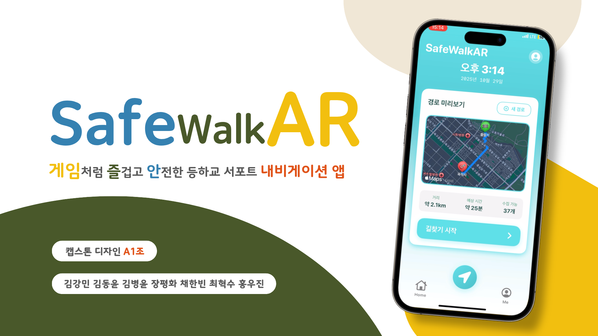
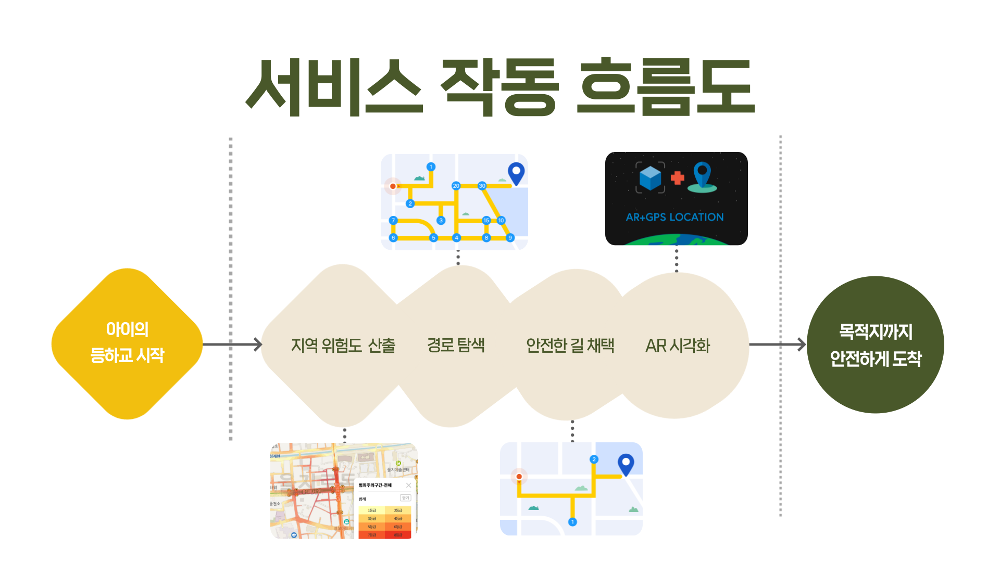
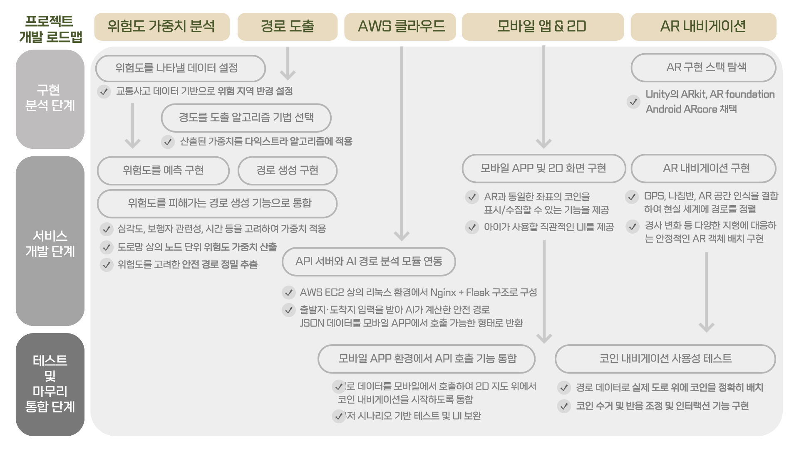
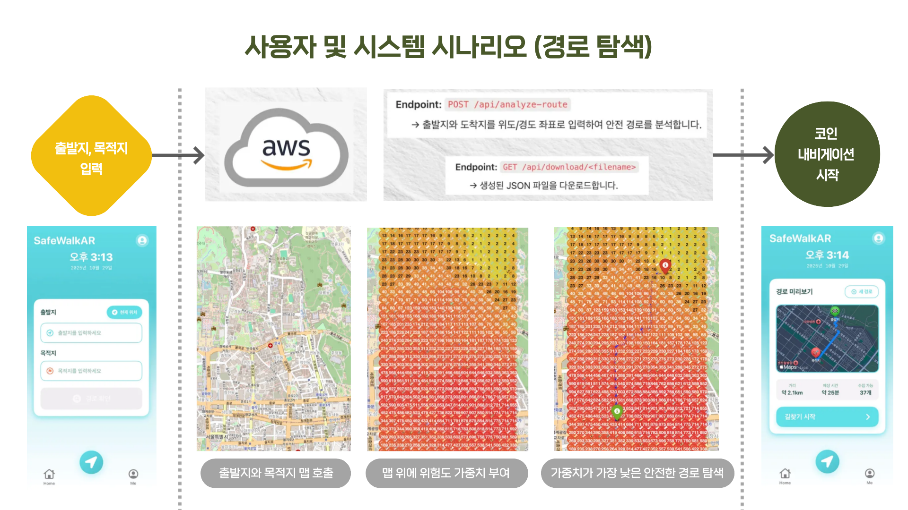
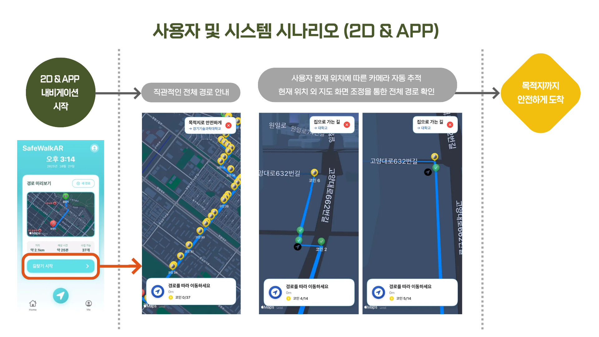
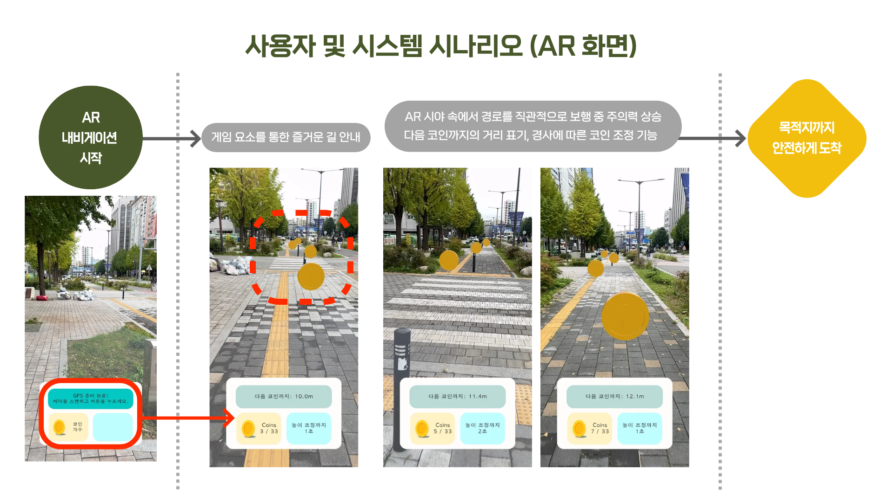
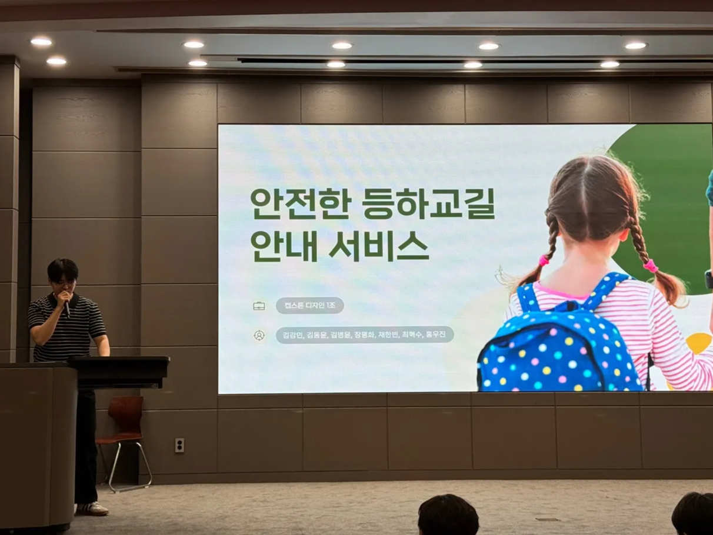
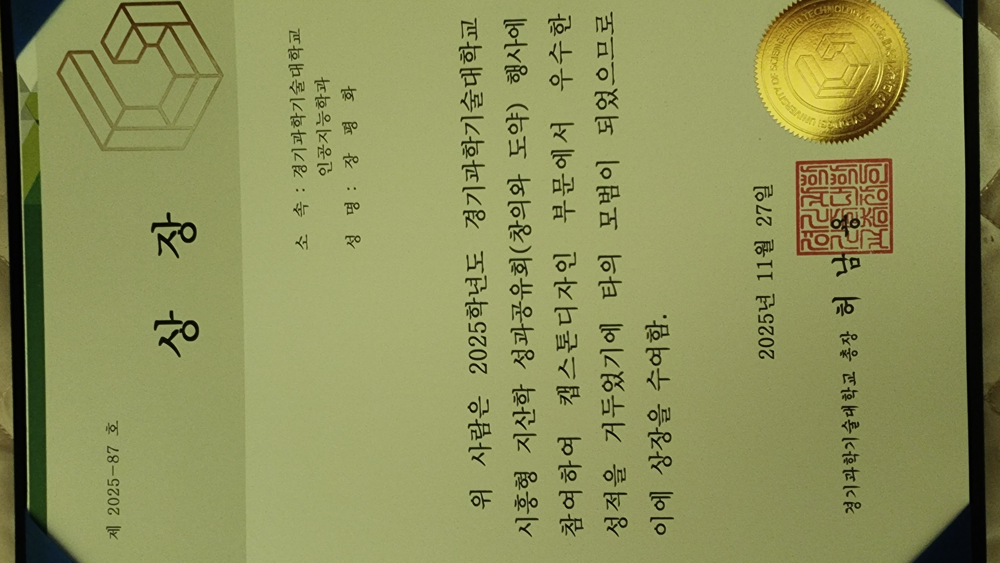

# 🛡️ SafeWalkAR
### AI-Based AR Navigation Service for Children's Safe School Commute

<p align="center">

</p>

<p align="center">


</p>

---

# 📖 Overview

SafeWalkAR는 AI 기반 위험도 분석과 AR 내비게이션을 결합하여 어린이가 **스스로 안전한 등하굣길을 이동할 수 있도록 지원하는 서비스**입니다.

기존 어린이 안전 서비스는 보호자가 아이의 위치를 확인하거나 위험 상황을 알리는 기능에 집중되어 있습니다.

SafeWalkAR는 한 단계 더 나아가, **AI가 분석한 안전 경로를 실제 도로 위에 AR 코인 형태로 시각화**하여 아이가 게임처럼 즐겁게 길을 따라갈 수 있도록 설계했습니다.

본 프로젝트는 2025학년도 캡스톤디자인 프로젝트로 진행되었으며,

- AI 위험도 분석
- 안전 경로 생성
- AWS 기반 API 서버
- Mobile Navigation
- Unity AR Navigation

까지 하나의 서비스로 구현하였습니다.

---

# 🎥 Demo

## 💡 Idea Introduction

https://youtu.be/zockLh4R2Lk

프로젝트의 기획 배경과 서비스 아이디어를 소개하는 영상입니다.

---

## 🚀 Final Demonstration

https://youtu.be/lKd-h1pzmws

실제 구현된 SafeWalkAR 서비스 시연 영상입니다.

---

# 🚸 Background

최근 맞벌이 가정 증가와 초등학생의 자율 등하교 증가로 인해 어린이 보행 안전 문제가 지속적으로 발생하고 있습니다.

기존 서비스들은 위치 공유 또는 보호자 중심의 모니터링 기능은 제공하지만,

> **아이 스스로 안전한 길을 선택하고 따라갈 수 있도록 돕는 서비스는 부족했습니다.**

SafeWalkAR는 이러한 문제를 해결하기 위해

- AI 기반 위험도 분석
- 안전 경로 추천
- AR 길 안내

를 하나의 서비스로 통합하였습니다.

---

# ✨ Key Features

✅ AI 기반 위험도 분석

도로별 위험도를 계산하여 가장 안전한 경로 생성

✅ Mobile Navigation

생성된 안전 경로를 모바일 지도에서 직관적으로 확인

✅ AR Navigation

실제 도로 위에 AR 코인을 생성하여 아이가 자연스럽게 길을 따라 이동

✅ Gamification

코인 수집 요소를 추가하여 아이들의 자발적인 참여 유도

✅ Cloud API

AWS EC2 + Flask 기반 서버를 통해 AI 분석 결과를 모바일 앱으로 전달

---

# 🔄 Service Flow

<p align="center">

</p>

SafeWalkAR는 다음과 같은 순서로 동작합니다.

1. 출발지와 목적지를 입력
2. AI가 위험도를 분석하여 안전 경로 생성
3. Mobile App에서 안전 경로 확인
4. Unity AR Navigation 실행
5. 현실 공간에 AR 코인 생성
6. 코인을 따라 목적지까지 이동

---

# 🏗️ System Architecture

<p align="center">

</p>

SafeWalkAR는 AI 기반 경로 탐색 시스템과 AR 내비게이션을 하나의 서비스로 통합한 프로젝트입니다.

사용자가 목적지를 입력하면 AI 서버가 위험도를 고려한 안전 경로를 생성하고, 모바일 애플리케이션이 해당 경로를 수신합니다. 이후 Unity AR 모듈은 GPS와 나침반 정보를 기반으로 실제 공간에 AR 코인을 배치하여 사용자가 직관적으로 이동할 수 있도록 지원합니다.

---

# ⚙️ Development Process

SafeWalkAR는 다음과 같은 순서로 개발되었습니다.

```
위험 데이터 수집

        ↓

안전 경로 생성 알고리즘 개발

        ↓

Flask API 서버 구축

        ↓

Mobile App 개발

        ↓

Unity AR 모듈 개발

        ↓

실환경 테스트 및 개선
```

---

# 📱 Service Scenario

## 1. AI 기반 안전 경로 탐색

<p align="center">

</p>

사용자가 출발지와 목적지를 입력하면 AI 서버가 위험도를 고려하여 최적의 안전 경로를 생성합니다.

경로 생성에는 OpenStreetMap 데이터를 기반으로 위험도 가중치를 적용하였으며, 일반 최단경로가 아닌 안전성을 우선한 경로를 제공합니다.

---

## 2. Mobile Navigation

<p align="center">

</p>

생성된 안전 경로는 모바일 애플리케이션에서 확인할 수 있습니다.

사용자는 이동 경로와 위험 지역을 직관적으로 확인할 수 있으며, AR 모드로 전환할 수 있습니다.

---

## 3. AR Navigation

<p align="center">

</p>

Unity AR Foundation과 ARKit을 활용하여 AI가 생성한 경로를 현실 공간 위에 시각화했습니다.

GPS 위치와 나침반 방향을 기준으로 AR 좌표계를 생성하고, 코인을 실제 도로 위에 배치하여 아이가 자연스럽게 따라갈 수 있도록 구현했습니다.

---

# 🧩 Core Features

### AI Route Analysis

- 위험도 기반 안전 경로 생성
- OpenStreetMap 데이터 활용
- JSON 형태의 경로 데이터 생성

---

### Mobile Application

- 출발지 및 목적지 입력
- 2D 지도 기반 경로 확인
- AR 모드 전환

---

### Unity AR Navigation

- GPS 기반 위치 계산
- Compass 기반 방향 보정
- AR Foundation 평면 인식
- AR Coin 생성 및 자동 수집

---

### Cloud Server

- Flask REST API
- AWS EC2 배포
- JSON 데이터 통신

---

# 🛠️ Tech Stack

|분야|기술|
|---|---|
|Language|Python, C#, Swift|
|Framework|Flask, Unity, AR Foundation|
|AR|ARKit, GPS, Compass|
|Cloud|AWS EC2|
|Data|JSON, OpenStreetMap|
|Algorithm|OSMnx, NetworkX, Dijkstra|
|Version Control|Git, GitHub|

---

# 📂 Repository Structure

```text
SafeWalkAR

├── Assets
│   ├── Scenes
│   ├── Scripts
│   ├── Prefabs
│   ├── Resources
│   ├── Materials
│   └── Audio
│
├── Packages
│
├── ProjectSettings
│
├── README.md
│
└── images
```

---

# 💻 AR Module

AR 모듈은 전체 프로젝트에서 제가 직접 설계하고 개발한 핵심 기능입니다.

주요 구현 내용은 다음과 같습니다.

- GPS 기반 위치 계산
- Compass 방향 보정
- JSON 경로 데이터 파싱
- AR Coin 생성
- 실시간 거리 계산
- 자동 코인 수집
- 바닥 높이 자동 재조정
- 사용자 인터페이스 구현

---

# 🙋 My Contributions

본 프로젝트에서 다음과 같은 역할을 담당하였습니다.

### Project Manager

- 프로젝트 아이디어 제안
- 서비스 기획
- 일정 관리
- 역할 분담
- 발표 준비

### AR iOS Development

- Unity 기반 AR 모듈 개발
- GPS 및 Compass 기반 좌표 보정
- AR Foundation 활용
- JSON 데이터 연동
- AR Coin 생성 및 최적화

### Presentation

- 중간 발표
- 최종 발표
- 시연 영상 제작

---

# 📊 Project Results

SafeWalkAR는 AI 기반 위험도 분석과 AR 내비게이션을 하나의 서비스로 통합하여 어린이가 스스로 안전한 등하굣길을 이동할 수 있도록 지원하는 서비스를 구현하였습니다.

기존 위치 추적 중심 서비스와 달리, AI가 생성한 안전 경로를 실제 공간 위에 AR 콘텐츠로 시각화하여 사용자가 직관적으로 따라갈 수 있도록 구현한 것이 본 프로젝트의 가장 큰 특징입니다.

---

## 🖼️ Project Poster

<p align="center">

</p>

프로젝트의 전체 구조와 핵심 기능을 정리한 캡스톤디자인 전시 포스터입니다.

---

# 📱 Implementation

### AI Safe Route

- 위험도 기반 안전 경로 생성
- OpenStreetMap 데이터 활용
- JSON 기반 경로 데이터 생성

---

### Mobile Navigation

- 출발지 및 목적지 검색
- 안전 경로 확인
- AR 모드 실행

---

### AR Navigation

- GPS 기반 위치 계산
- Compass 방향 보정
- AR Coin 생성
- 자동 코인 수집
- 실시간 거리 계산

---

# 🎤 Presentation

<p align="center">

</p>

프로젝트 진행 과정에서 중간 발표와 최종 발표를 수행하였으며,

서비스 기획, 시스템 구조, 구현 과정 및 결과를 직접 발표하였습니다.

또한 최종 시연 영상을 제작하여 프로젝트의 전체 동작 과정을 소개하였습니다.

---

# 🏆 Achievement

<p align="center">

</p>

SafeWalkAR 프로젝트는

**2025 시흥시 지·산·학 캡스톤디자인 졸업작품전에서 동상을 수상**하였습니다.

서비스의 기획력과 기술적 완성도, 실제 활용 가능성을 인정받아 우수 프로젝트로 선정되었습니다.

---

# 👥 Team

|이름|담당|
|---|---|
|장평화|Project Manager, AR iOS Development|
|김강민|Backend|
|김동윤|Android|
|김병윤|AI Model|
|최혁수|Backend|
|채한빈|Android|
|홍우진|AI Route Analysis|

---

# 📅 Project Information

|항목|내용|
|---|---|
|Project|SafeWalkAR|
|Duration|2025.03 ~ 2025.11|
|Type|Capstone Design|
|Team Size|7명|
|My Role|Project Manager / AR iOS Developer|
|Development|AI + Mobile + Backend + AR|

---

# 🌱 What I Learned

이번 프로젝트를 통해 단순히 기능을 구현하는 것보다 **서비스의 목적을 이해하고 사용자 경험을 고려하는 과정이 중요하다는 것을 배울 수 있었습니다.**

팀장으로 프로젝트를 기획하고 일정을 관리하며 다양한 전공의 팀원들과 협업하는 경험을 쌓았고, Unity AR Foundation과 ARKit을 활용하여 실제 공간과 가상 공간을 연결하는 AR 서비스를 구현하였습니다.

또한 GPS와 나침반 센서를 이용한 좌표 보정, JSON 기반 데이터 연동, 사용자 인터페이스 설계 등 다양한 기술을 직접 구현하며 문제 해결 능력을 키울 수 있었습니다.

---

# 🚀 Future Work

향후에는 다음과 같은 기능을 추가하여 서비스를 고도화하고자 합니다.

- 실시간 교통 정보 반영
- CCTV 및 공공데이터 연동
- 음성 안내 기능
- 보호자 실시간 모니터링
- 다중 사용자 파티 기능
- Apple Vision Pro 등 차세대 XR 기기 지원

---

# 📂 Related Repository

AI Route Analysis

https://github.com/woojinhong03/Capstone_SafeMap

---

# 🎥 Demo Video

### 💡 Idea Introduction

https://youtu.be/zockLh4R2Lk

---

### 🚀 Final Demonstration

https://youtu.be/lKd-h1pzmws

---

# 📄 License

This repository is intended for educational and portfolio purposes.

---

<div align="center">

### SafeWalkAR

AI-Based AR Navigation Service for Children's Safe School Commute

Capstone Design Project 2025

Made by **Pyeonghwa Jang**

</div>

